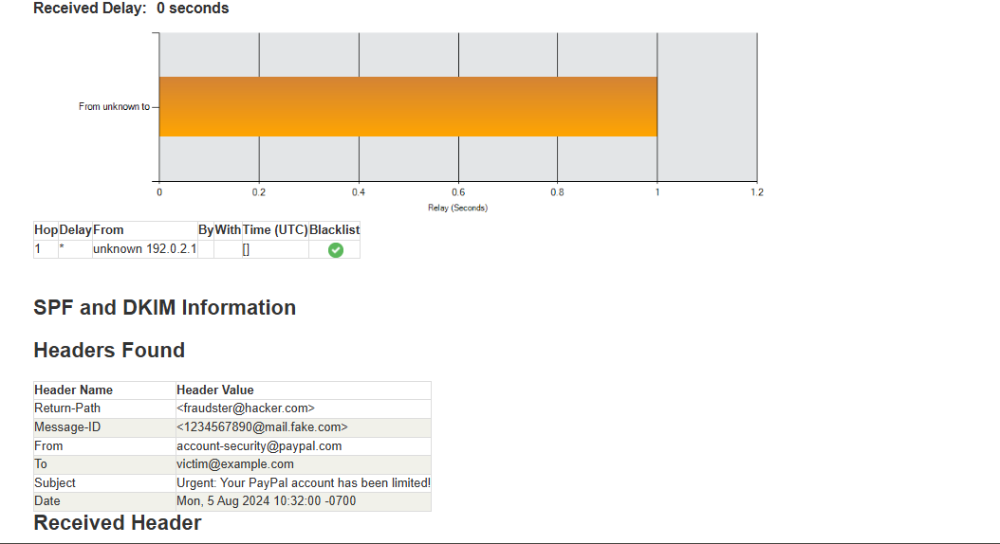

# 📧 Phishing Email Analysis - Cybersecurity Internship Task 2

## 📝 Task Objective:
Analyze a suspicious email sample to identify phishing characteristics and demonstrate awareness of email-based threats and tactics.

---

## 📂 Files Included:
- `phishing_sample_email.txt` – Sample phishing email text.
- `README.md` – This report documenting the phishing indicators.

---

## 🔍 Phishing Indicators Identified:

| Indicator               | Description                                                                 |
|-------------------------|-----------------------------------------------------------------------------|
| **Spoofed Email**       | Sender appears as `account-security@paypal.com` – looks official but fake. |
| **Suspicious Link**     | URL: `http://paypal-verification-alert.com/login` – not an official domain.|
| **Header Issues**       | Return path from unknown domain, suspicious IP in header.                  |
| **Urgent Language**     | "Urgent", "Immediately", "Permanently disabled" to scare the user.          |
| **Social Engineering**  | Uses fear and urgency to trick users into clicking links.                   |
| **Mismatched URLs**     | Displayed link text doesn't match actual destination URL.                   |
| **Grammar Errors**      | Minor issues like missing punctuation.                                      |

---

## 🛠 Tools Used:
- Text Editor (VS Code)
- [MxToolbox Email Header Analyzer](https://mxtoolbox.com/EmailHeaders.aspx) – for header analysis
- GitHub – for version control and report submission

---

## 📌 Summary:
This task demonstrates how attackers craft phishing emails using spoofed identities, fake links, and urgent messages. By analyzing headers and email content, we can detect and report such threats effectively.

---

## ✅ Outcome:
- Awareness of phishing characteristics
- Improved ability to analyze email threats
- Practical use of header analysis tools and GitHub reporting

---
## 🖼 Screenshot (Email Header Analysis)

---

## 🔗 Submission:
Repository submitted as part of Task 2 for the cybersecurity internship.

